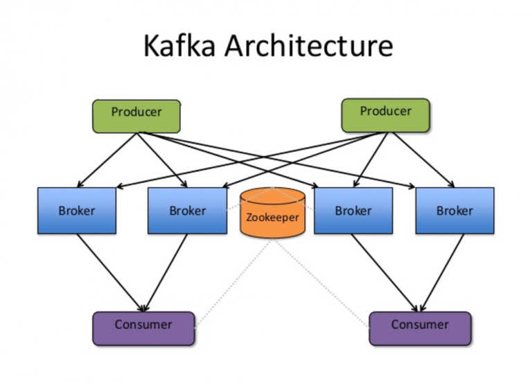
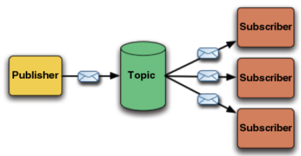
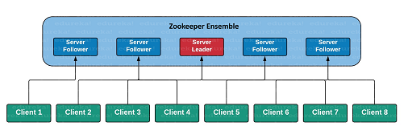
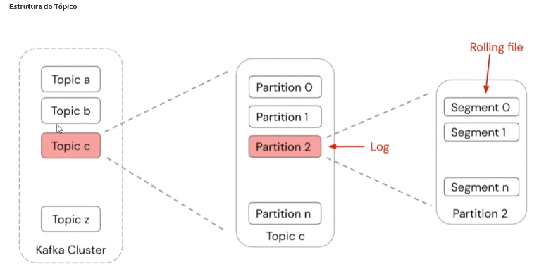
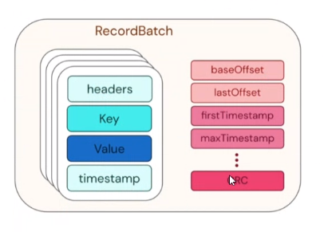
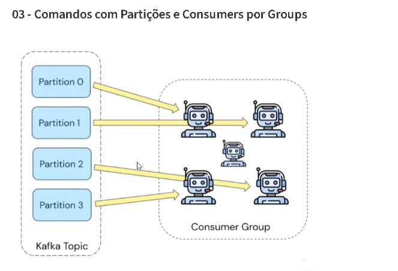
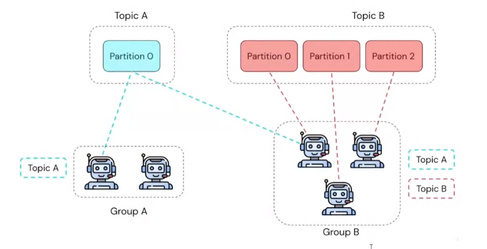
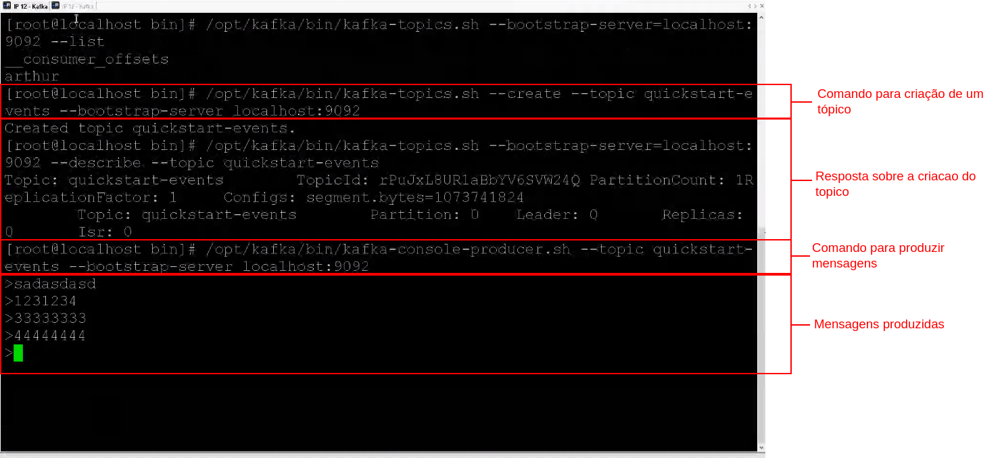
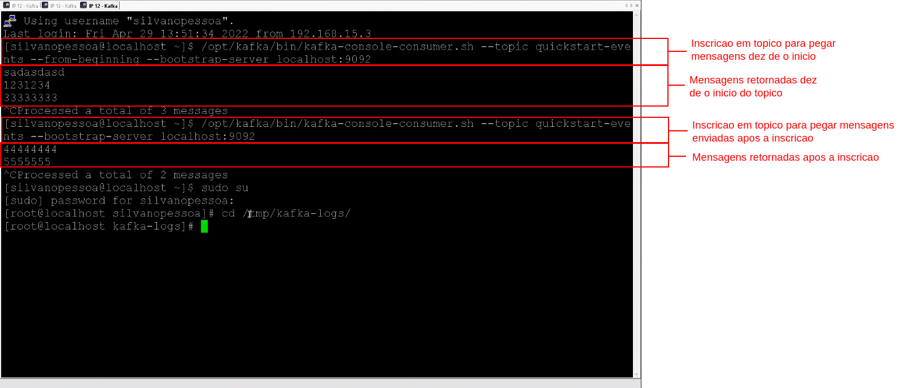

# Apache Kafka

Kafka é um dos sistemas de mensagens mais populares atualmente. Ele foi projetado para sistemas distribuídos de alto rendimento para gerenciar a fila e o fluxo de dados e sua Instalacao simples, basta ter os arquivos em um diretorio e criar os servicos responsaveis por executar.

Objetivo: Resolucao de problemas no processamento de filas de forma assincrona.

A arquitetura do Kafka é projetada com base em vários componentes e cada componente tem seu papel único.

<p align="center">
    
</p>

- Broker – Um cluster Kafka é composto por vários Kafka Brokers. Cada Kafka Broker possui um ID exclusivo. Os Kafka Brokers contêm partições de log de tópicos. Conectar-se a um agente inicializa um cliente em todo o cluster Kafka.

- ZooKeeper – Um recurso que é necessário para a eleição de liderança dos pares Kafka Broker e Topic Partition. Kafka usa o Zookeeper para gerenciar a descoberta de serviços para Kafka Brokers que formam o cluster. O Zookeeper envia as alterações da topologia para o Kafka, para que cada nó no cluster saiba quando um novo broker entrou, um Broker morreu, um tópico foi removido ou um tópico foi adicionado, etc. E necessario ter uma instancia do ZooKeeper em execucao na maquina para que o Kafka possa se conectar.

- Produtor – Produtores enviam dados para corretores. Quando o novo broker é iniciado, todos os produtores o descobrem e enviam automaticamente uma mensagem para esse novo broker.

- Consumidor – Os consumidores buscam dados dos corretores. O consumidor Kafka divide partições em instâncias de consumidor dentro de um grupo de consumidores. Cada consumidor no grupo de consumidores é um consumidor exclusivo de uma fair sharedas partições. É assim que Kafka faz o balanceamento de carga de consumidores em um grupo de consumidores. A associação do consumidor dentro de um grupo de consumidores é tratada dinamicamente pelo protocolo Kafka. Se novos consumidores ingressarem em um grupo de consumidores, ele receberá uma parte das partições. Se um consumidor morrer, suas partições serão divididas entre os consumidores ativos restantes no grupo de consumidores. É assim que Kafka faz failover de consumidores em um grupo de consumidores.

## Tipos de filas
- Topico: é o tipo de destino em um modelo de distribuição 1 para muitos. A mesma mensagem publicada é recebida por todos os assinantes consumidores.
<p align="center">
    
</p>

- Queue: é um destino 1 para 1 de mensagens. A mensagem é recebida por apenas um dos receptores de consumo. As mensagens enviadas para uma fila são armazenadas no disco ou na memória até que alguém as pegue ou expire.
<p align="center">
    
</p>

IMPORTANTE: Todas as filas dentro do Kafka sao do tipo topico, porem a forma de trabalhar pode caracterizar a fila como tipo queue.

## O que é o ZooKeeper ?
O [ZooKeeper](https://zookeeper.apache.org/) é um serviço centralizado para manter informações de configuração, nomear, fornecer sincronização distribuída e fornecer serviços de grupo. Todos esses tipos de serviços são usados ​​de uma forma ou de outra por aplicativos distribuídos. Cada vez que eles são implementados, há muito trabalho para corrigir os bugs e as condições de corrida que são inevitáveis. Por causa da dificuldade de implementar esses tipos de serviços, os aplicativos inicialmente costumam economizar neles, o que os torna frágeis na presença de mudanças e difíceis de gerenciar. Mesmo quando feito corretamente, diferentes implementações desses serviços levam à complexidade de gerenciamento quando os aplicativos são implantados.
Saiba mais sobre o ZooKeeper no [ZooKeeper Wiki](https://cwiki.apache.org/confluence/display/ZOOKEEPER/Index).

<p align="center">
    
</p>

O diferencial do Kafka esta na criacao de particoes, o processamento e distribuido entre essas particoes, uma observacao importante, os indice da particao inicil e zero, logo quando o valor for exibido refere-se ao indice da particao e nao a quantidade disponivel.

 O balanceamento de processos do Kafka e feito com escalonamento Round  Robin. Assim nao existe um limite temporal de processamento por seguindo e sim dependente da quantidade de hardware disponivel para craicao das partivcoes.

<p align="center">
    
</p>

Para garantir filas ordenadas e necessario que o topico tenha apenas uma unica particao.

## Estrutura das mensagens

Se um consumer pegar a mensagem os demais conssumers ainda poderam pegalas, porem para aquele consummer que ja pegou a mensagem conta como processada e sai da fila

E possivel passar Headers, Key, Value e timestamp.

<p align="center">
    
</p>

um consumer tem a opcao de se conectar e receber todas as mensagens des de o comeco do topico, ou apenas o que for inserido apos a conecxao.

Os consumers possuem identificador.

DICA: Estudar com maquinas virtuais, instalar Cent OS, e Kafka.

Kafka trabalha com arquivos de texto para armazenar as msgs, estilo beetreaver, armazena em um arquivo de log muito bem organizado.

Se a fila cair e possuivel recuperar as msgs de acordo com o tempo configurado para permacencia das mensagens arnmazenadas.

## Consumers em grupo

Quando um grupo de consumer se conecta a um topico, cada consumer so pode se conectar a uma unica particao, porem e possivel estabelecer que outro consumer assuma a particao caso um consumer principal caia. Se houver outro grupo de consumer a mesma regra e valida para o outro grupo.

<p align="center">
    
</p>

<br>
Grupos podem se conectar e mais de um topico.

<p align="center">
    
</p>

## Comandos

- Comandos Basicos
```bash
# Listar todos os topicos
kafka-topics.sh --bootstrap-server=localhost:9092 --list

# Criar um topico
kafka.topics.sh --create --topic quickstart-events --bootstrap-server localhost:9092

# Exibir descricao de um topico
kafka-topics.sh --boostrap-sever=localhost:9092 --describe --topic quickstart-events

# Produzir mensagens no topico
kafka-console-producer.sh --topic quickstart-events --bootstrap-server localhost:9092

# Consumir todas as mensagens de um topico
kafka-console-consumer.sh --tipic quickstart-events --from-beginnig --bootstrap-server localhost:9092

# Consumir as mensagens novas de um topico
kafka-console-consumer.sh --topic-quickstart-events --bootstrap-server localhost:9092
```
<br>
- comandos para criacao de grupos.

```bash
# Criar topico com particoes
kafka-topics.sh --create --topic quickstart-events-part --bootstrap-server localhost:9092 --partitions 3

#Consumir as mensagens de um topico por grupo
kafka-console-consumer.sh --topic quickstart-events-part --bootstrap-server localhost:9092 --group boleto

# Produzir mensagens no topico com particoes
kafka-console-producer.sh --topic quickstart-events-part --bootstrap-server localhost:9092

# Exibir uma descricao do grupo
kafka-consumer-groups.sh --bootstrap-server localhost:9092 --group boleto --describe
```

## Exemplos

<p align="center">
    
    Criacao de topico e producao de mensagens
</p>
<br>


<p align="center">
    
    inscricao em topico
</p>

